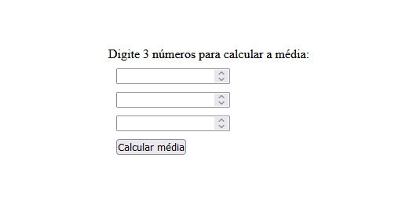

<h1 align="center"> Code Together JavaScript Foundation </h1>

Projeto para base de conhecimento de JavaScript Foundation

Descrição da tarefa:

-Assista ao Code Together que se encontra no vídeo da nossa tarefa. Para melhor entendimento, pause o vídeo sempre que necessário para programar o código junto do professor. 
- Descrever um algoritmo para resolver o problema da travessia de modo seguro.
- Exibir média de 3 números com entradas pelo formulário HTML

<h2>🚀 Tecnologias utilizadas: </h2>

- HTML
- CSS
- JavaScript

<h2>📝 Licença</h2>
Esse projeto está sob a licença MIT. Veja o arquivo LICENSE para mais detalhes.
